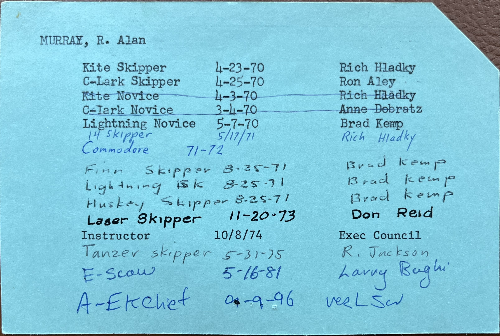
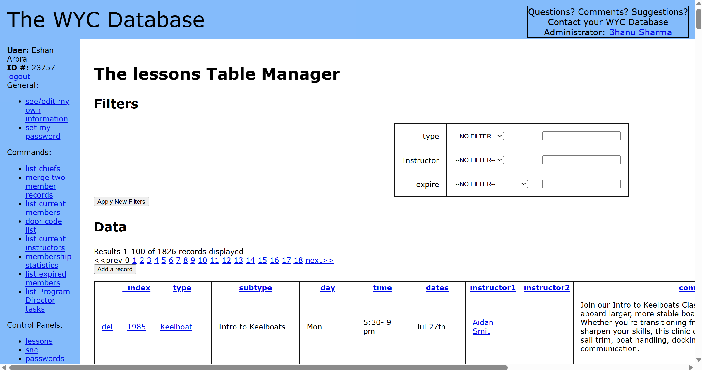
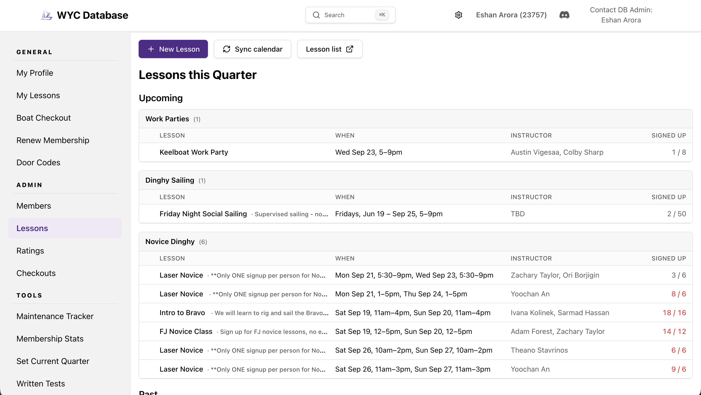
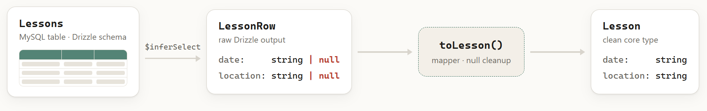
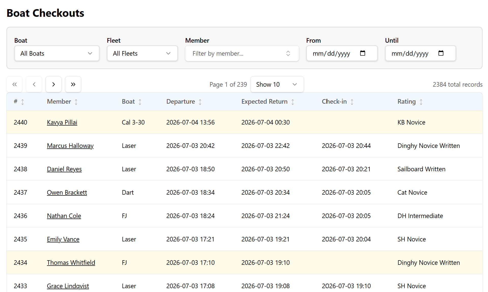

## Context

The Washington Yacht Club (WYC) is a student-run recreational sailing club at the University of Washington in Seattle. Its mission is to teach sailing and make it accessible, especially to students of the University.

The club needs to manage records for 150+ members, along with lesson signups, member ratings, boat checkouts, officer positions, new member signups & renewals, and much more. From the founding of the WYC in 1948 until 2007, this bookkeeping was done on paper.

_Ratings card of former WYC Commodore Alan Murray, 1970_

In 2007, a MySQL database and corresponding Perl website interface digitized these records, creating the `WYC Database` website. It was a state-of-the-art tool for its time. However, some parts were starting to break, others getting harder to maintain, and there was a desire for new features. For easier development of these features, and long-term resiliency, I took on the task of rewriting the WYC Database code for the modern era of the WYC.

_Lessons management page on the old WYC Database_

## Goals

I joined the WYC in my first year of college, and got involved with leadership by my second year. My domain experience with the club and its history, combined with my computer science background and desire for a project, put me in a uniquely good position to work on this.

While I initially tried to work with the Perl code and legacy hosting, it became clear that a modern stack was necessary to make real progress and create a lasting new tool. It was important to me that this system was resilient and maintainable, something that would survive beyond my tenure in the club. The previous WYC Database lasted for 20 years, who knows how long this one could last?

I also focused on future maintainability. After it took me many hours to figure out how the existing system worked, locate account credentials, and reconstruct why certain decisions were made, I suspected this difficulty was one reason why the technology had been neglected for a while. Switching to modern languages and technology certainly makes it easier for the new generation, but it also provided an opportunity to upgrade the entire surrounding infrastructure and ensure proper documentation.

Lastly, the system shouldn't be complicated. Club officers come and go, and time spent learning how to use the Database is time spent not sailing!

_New lessons management page_

## Technical Details

### Type Driven Design

The code in this application is very domain specific. For this reason, it is extremely helpful to follow strict <a href="https://mayhul.com/posts/type-driven-design/" target="_blank" rel="noopener noreferrer">typing principles</a> that accurately model the real-world paradigms that the club deals with. This allows the code to better represent the truth of the world, lets humans reason about data representations at a high level, and helps AI to understand the relationship between entities when it otherwise wouldn't.

> I've noticed that AI often makes incorrect assumptions about sailing or yacht club intricacies, which the type system is supposed to help with. To make general knowledge work with AI easier for the WYC (or any specific domain), it seems important to have some fundamental documents that thoroughly explain the nature of the club, and specifics about complex parts.

I chose to work with the original database schema instead of creating a new one. All things considered, it is quite well made and durable. However, the idiosyncrasies of a 20-year-old schema require some cleaning up before it reaches the core application logic. I used a layered type system that transforms raw database rows into rich and clean application models.

> Only after I made significant progress and had written many queries did I feel confident that a new schema written by me would be an improvement over the original. Even now I'm not sure a rewrite is necessary, though I have already made a lot of changes.

Static typing also has concrete benefits for development and system guarantees. When I change a type to match something I've learned about the domain, TypeScript propagates the consequences to every use site, including the mappers that translate the old schema into core types. Mismatches between my mental model and what the database stores surface immediately, right where they need to be resolved. This static checking makes it easy to follow the path of the data and find the truth, while eliminating an entire class of bugs.

### Tech Stack

I sought to use technologies that don't get in the way and allow me to focus on the product and overall architecture. <a href="https://tanstack.com/" target="_blank" rel="noopener noreferrer">TanStack</a> tools are great for this: Query, Form, Table, Start. TanStack Start is a web framework that brings frontend and backend logic into one type-safe project, so I don't have to think about the wiring.

<a href="https://orm.drizzle.team/" target="_blank" rel="noopener noreferrer">Drizzle ORM</a> is at the right level of abstraction, adding structure and type safety without forcing me to redesign the schema around it. <a href="https://vercel.com/" target="_blank" rel="noopener noreferrer">Vercel's</a> deploy on push _just works_, <a href="https://resend.com/" target="_blank" rel="noopener noreferrer">Resend</a> makes email easy to set up, and <a href="https://www.cloudflare.com/products/r2/" target="_blank" rel="noopener noreferrer">Cloudflare R2</a> provides simple object storage for waivers. At the club's scale, most free tiers cover our needs.

## Effectively using, and learning with, AI

Initially, I was torn between wanting to use this project as a learning experience by going slow while understanding everything, or getting it done faster with AI and black-box some of the details. This turned out to be a false dilemma. Getting a deep, solid understanding was necessary for progressing as the application became more complicated.

> I initially took a more vibe-heavy approach, as an experiment to explore _agentic_ development. I quickly stopped, as the code was both extremely low quality (although I think this can be improved) and deeply unsatisfying to build. More importantly, it did not serve the goals of resiliency and maintainability well.

### Learning

Many of the admin pages on the site are simple table viewers, with filtering and sorting for records such as members, ratings, and checkouts. The knowledge and techniques to build one page carry over to the rest, for the most part.

My learning strategy was to start by developing one page end-to-end, from the DB all the way to deployment, making sure I understood every layer. Then I could confidently use AI to horizontally scale more pages, reviewing new code as I went, and following existing good patterns I had built and thought hard about the first time. This provided the balance of learning while increasing speed through repetitive work.

As I worked, I gained a greater sense of my software design preferences, and developed the agents file accordingly. AI allowed me to easily change existing code patterns or generalize components when necessary to keep the codebase clean. Without AI, continually refactoring code I had already written would be frustrating and probably lead to worse quality.

Building many of these simpler pages prepared me to successfully implement more complex features like membership processing.

### Voice Prompting

One of my favorite parts about AI is that it won't judge your stupid questions. I use it to float any idea I think of and understand its tradeoffs, or ask the most basic questions that would make a human re-consider whether I'm even qualified to take on this project.

I have so many thoughts in my head about the project, TypeScript principles, higher level deployment/infra, and then I start wondering how all of this is done in real production systems, and then I start making plans for future feature implementations, and so on... Voice prompting allows me to get all these ideas out fast, even <a href="https://uwplse.org/2026/05/05/Long-Prompter.html#voice-input-for-high-bandwidth" target="_blank" rel="noopener noreferrer">extraneous details</a> that I wouldn't bother to type out. I'm able to input everything I'm thinking, even changing my mind mid-prompt, and it only aids my learning because it gives the AI more context.

My general workflow for a new feature is to build a plan starting with a long voice prompt including the base requirements, possible implementations, tradeoffs, and uncertainties that I need a concrete search on (e.g. "What are common patterns to do X"). I'll always end by asking for clarifying or probing questions, which starts a conversation and ends with a specified solution. This conversation is where the learning and decision-making happens.

After implementation, I review the generated code, especially the hotspots where precise details can go wrong. I've found that once a feature is well specified, the crux of the logic lies in a small amount of backend code or a single DB query.

For bigger features like auth and membership renewals, I can turn these discussions into concise documentation for future maintenance (to be read by humans or AI). Poor documentation is a common issue in the WYC, probably because it's not very fun, but AI + voice prompting makes it much easier.

### Results

The work I put into strong foundations has paid dividends when implementing new features. Small changes can take less than 30 minutes, and significant ones take hours instead of days. When reviewing generated code now, it is clear that the time spent establishing good patterns was worth it and continues to keep the code maintainable. And of course, I have learned so much through the process.

## Future

The new platform now matches the old site's core capabilities, while adding several more high impact features: automated membership onboarding and renewals, improved lessons management, waiver signing, and more.

There are plenty more quality-of-life improvements to be made, as well as some bigger features that are well scoped for what I think of as "intern projects". These are intentionally left as projects to onboard a new contributor, especially a student looking to gain experience. These include:

- Digitizing existing sailing written exams (we have at least 5 different ones).
- Linking Discord accounts to WYC member profiles to enable programmatic communication.
- Improving the overall design and mobile UX, potentially rebranding to the WYC Member Portal.

This rewrite is also part of a larger effort to update the entirety of the club's technology. Future projects include moving database hosting off Dreamhost and moving the public website off WordPress (while carefully managing the cascading effects of these infrastructure changes).

## Acknowledgements

There are so many people that have volunteered countless hours to make the WYC thrive. I have so much respect for the original creators of the WYC Database, and its maintainers over the years. Thank you to my fellow officers and volunteers that support this awesome club.

If you're in Seattle, consider <a href="https://washingtonyachtclub.org" target="_blank" rel="noopener noreferrer">joining the Washington Yacht Club!</a>

<a href="https://github.com/washingtonyachtclub/wyc-database-v2" target="_blank" rel="noopener noreferrer">wyc-database-v2 Source Code</a>

