Atoms is a physical automation company, originally focused on kitchens and food delivery. These real-time systems require infrastructure with low latency and high availability. During my internship on the Infra Coordination team, I built an internal debugging tool that greatly improved the speed and accuracy of tracking shard movements in <a href="https://techblog.atoms.co/p/easy-as-pie-stateful-services-at" target="_blank" rel="noopener noreferrer">Splitter</a>.

## How Splitter works

Splitter is a control plane for distributing work across machines in a distributed system. Say you have some service, `order-central`, that wants to split its work. `order-central` will define domains, such as `facilities`, and Splitter divides these domains into shards, which are UUID ranges. Each shard is owned by a pod, which handles all work for that shard.

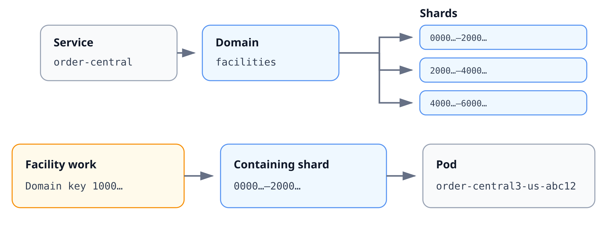

Each entity (a facility in this case) has a `domain key` (a UUID). When there is some work for an entity, Splitter figures out which shard contains this key and routes the work to the owning pod.

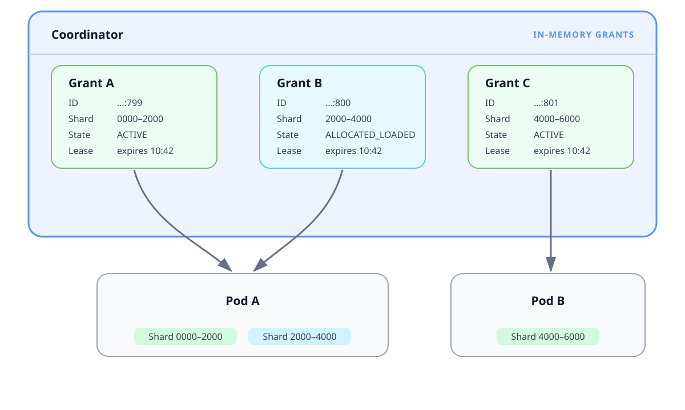

Splitter uses a single coordinator to manage shard assignments. The coordinator holds _grants_ in memory. A grant is a temporary assignment of a shard to a pod. _Grant A_ being active means that Pod A owns the `0000-2000` shard. If Pod A were to go down, the shard needs to be moved to another pod to maintain availability. In this case, Grant A would be removed and a new grant would be created, assigning the `0000-2000` shard to a new pod.

Grants go through different states in their lifecycle. Below is the complete state diagram, but you don't need to understand the details.

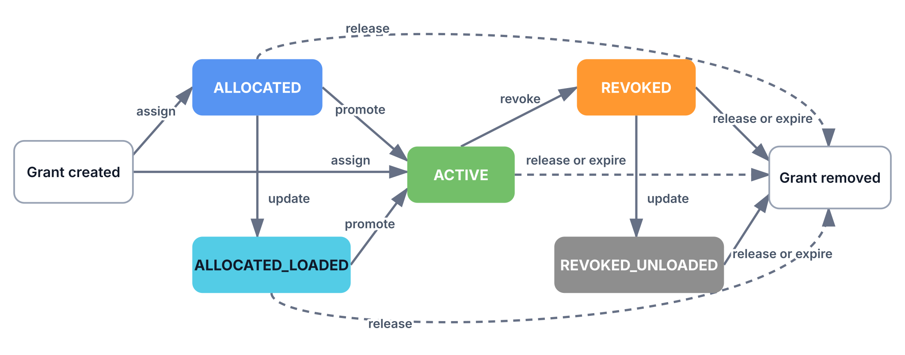

The concept of the canonical handoff is more important.

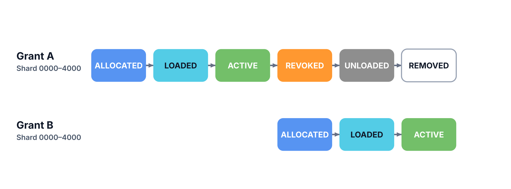

Suppose the Pod handling shard `0000-4000` goes down, so Grant A needs to be removed and Grant B must be created, assigning the shard to a new pod.

- When Grant A is `revoked`, Grant B is `allocated`.
- When Grant A is `unloaded`, Grant B is `loaded`.

This is the ideal case for Splitter when moving work.

## Why Splitter matters

Splitter is foundational infrastructure for essential systems like <a href="https://techblog.atoms.co/p/reliable-order-processing" target="_blank" rel="noopener noreferrer">KEQ</a>, so problems at this layer can surface as downstream issues such as:

- Missing orders
- Stalled message processing
- Unavailable storefront data

Any loss of Splitter availability degrades the reliability of dependent services. It's important we get this stuff right.

## The problem

Splitter moves work around a lot, but the team and maintainers of services that use Splitter did not have a good way to view historical shard ownership.

The coordination team would get support messages reporting that shard reassignments caused hundreds of printers to lose connection to the server, resulting in delays or failures. Another customer reported a shard being lost and never reassigned, asking the team to figure out the root cause.

Figuring out the root cause previously required piecing together logs from several different sources and writing new SQL queries every time, a painstaking process that slowed support and ultimately hurt reliability.

The goal: Given some domain key or pod identifier, view the associated grants over time.

## Creating the Shard Tracker

### Structured Logging

The first step to a solution was introducing structured logging. Existing logs were unstructured English prose that could not be programmatically ingested, and not every state transition was even covered by logs.

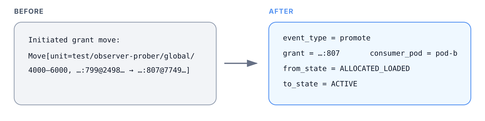

I started by converting the logs to a consistent JSON format. Now they can be queried to create some kind of shard tracker.

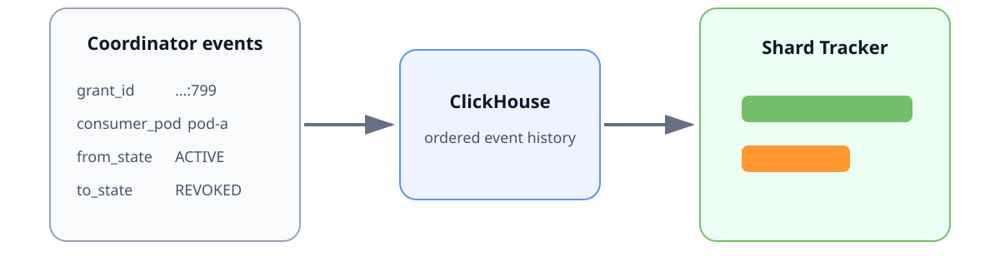

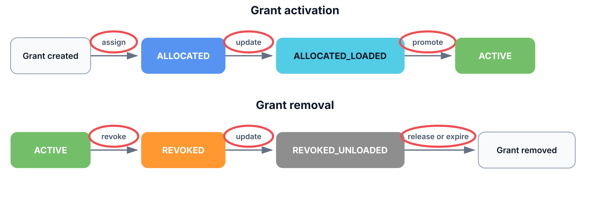

_Every transition logged to guarantee correctness_

### Dashboard Logic

Now suppose you want to view the state of a grant from 10 to 10:30. Let's take the naive approach of linearly reading each log associated with the grant within this window, and persisting the state until the next log.

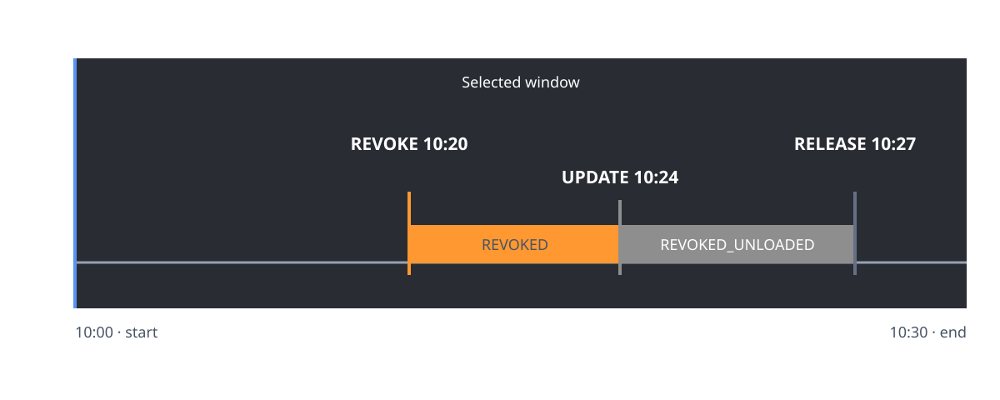

This looks good, but the grant is `revoked` without ever showing up as `active`. It turns out that this approach missed the log emitted when this grant became active at 9.

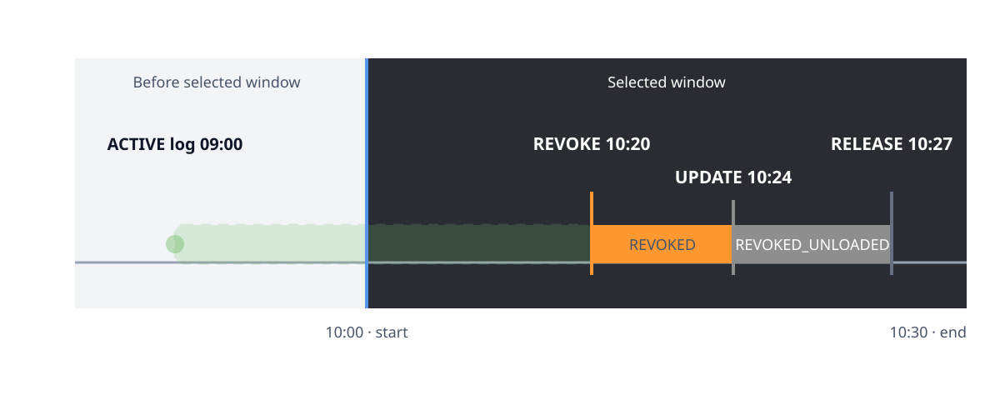

Now, you could search backwards starting from 10 to find the most recent log associated with this grant, but production grants can last for days at a time. Filtering through thousands of logs to find that one hurts performance badly. Instead, we could attach some more metadata to each log: both the `from_state` and `to_state` that the log borders.

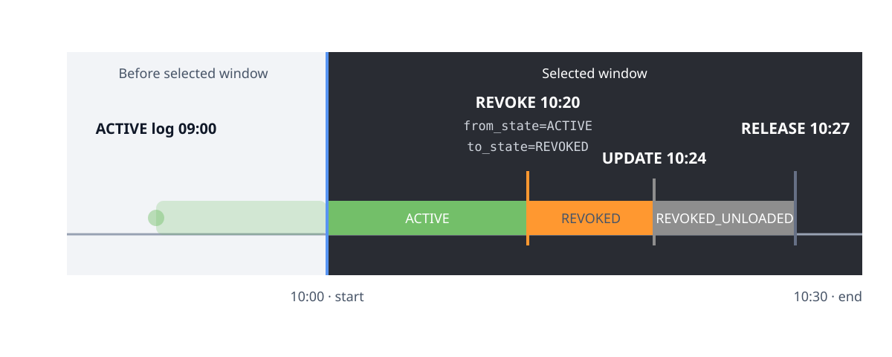

This allows us to quickly determine that the grant was active before the revoke log.

### Edge Case: Silent Grant

There could also be a grant that is active for the entirety of the selected window. No logs are emitted because its state does not change, so we can't apply the previous approach. A search backwards from the start time is even worse here, because we don't even have some grant ID to filter on.

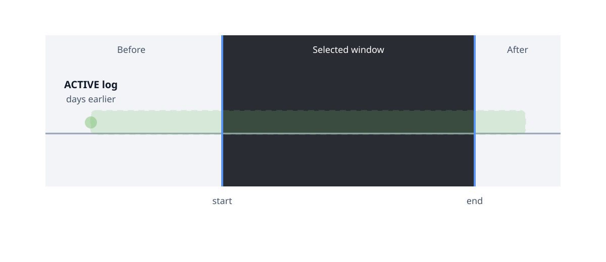

This brings me to the final step of the solution: checkpoint logs. The coordinator periodically logs its current shards and grants.

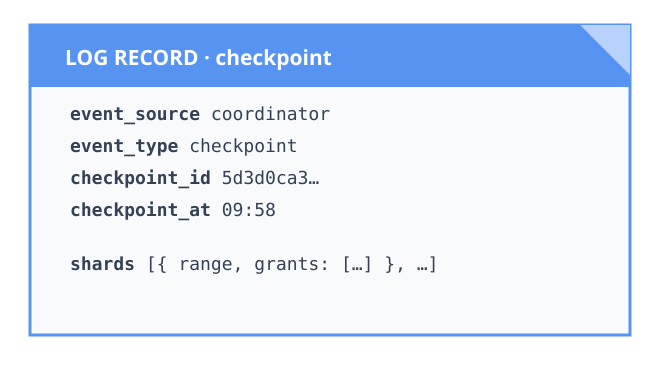

Now for this case we can just search back to the most recent checkpoint and recover the state of every grant on the timeline. This bounds the backward search to a single checkpoint interval.

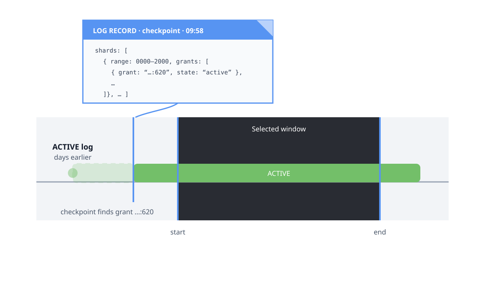

One correctness detail about checkpoints: the state of a grant at the most recent checkpoint is not necessarily the same as the state at the start of the selected window. The algorithm processes each log between the checkpoint and start to accurately reconcile the grant state.

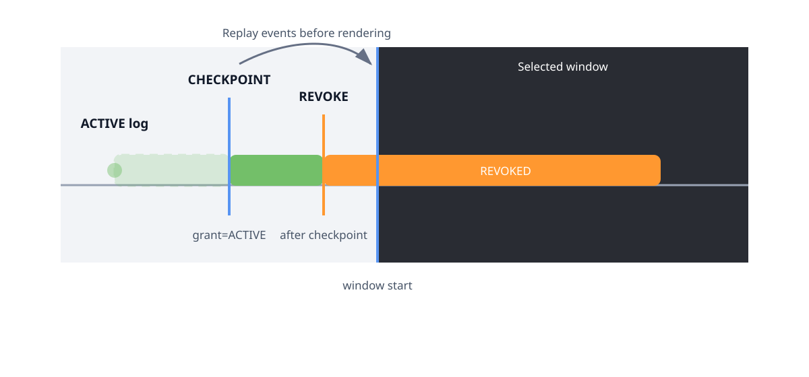

### Edge Case: Coordinator Restart

The Splitter coordinator itself is stateful. It runs on Splitter pods, and those pods can arbitrarily fail, triggering a coordinator restart. Because the coordinator stores grants in memory, the new coordinator after restart has no knowledge of its grants. However, the pods still keep authoritative ownership of the shard. Splitter resolves this by having the pods send attach messages up to the new coordinator.


The goal of the shard tracker is to show what the coordinator believed to be the state of grants at a given time. To accurately account for this case, I added logs on `coordinator_start` and each `attach` message. When the tracker sees a `coordinator_start`, it immediately stops tracking all grant states, as if they were all released. The tracker then reads each `attach` log to show the grants again.

## The live dashboard

This is an approximation of what the real dashboard looks like in Grafana. Each row represents a single grant. There are many filters, most importantly domain key and pod.

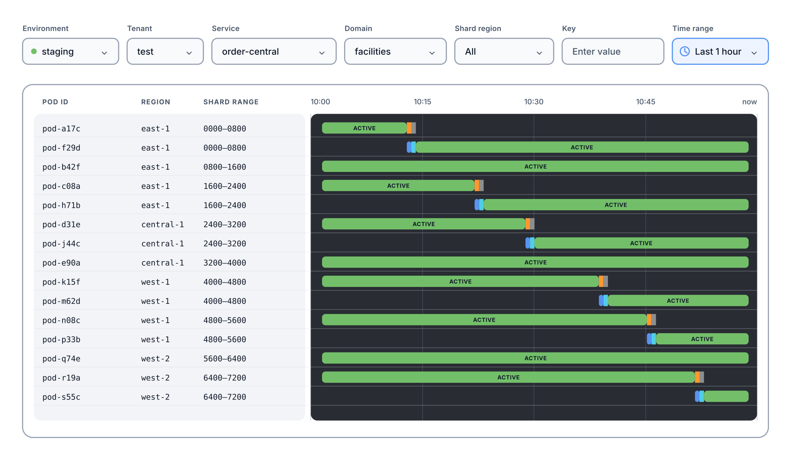

A user can filter by a domain key to see only the grants with shards containing that key. This reveals the ideal grant handoff from earlier.

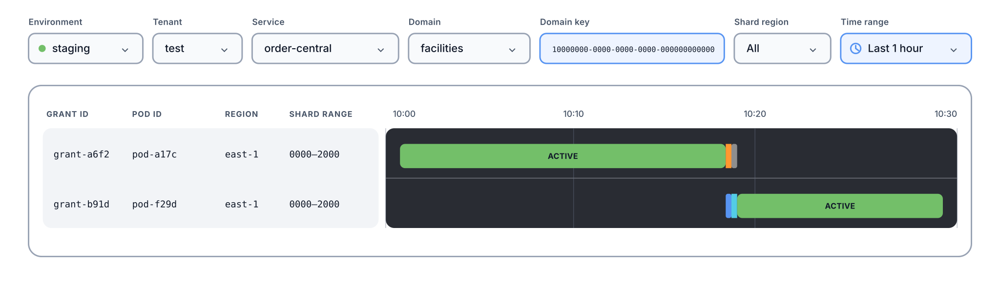

The event table puts each log on a row for easy debugging. Clicking on pod ID changes the dashboard filters to show all grants on that pod in the same selected window, which helps debug why a shard may have moved.

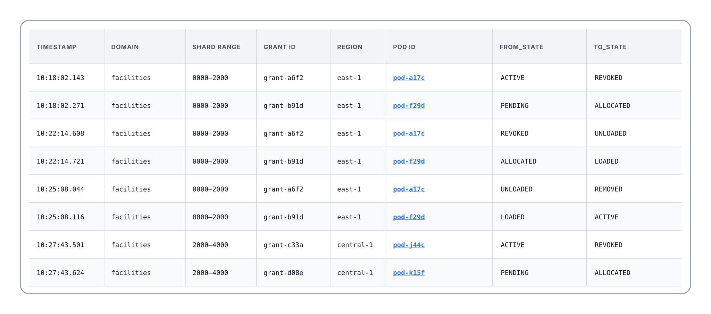

### Pod Shard Tracker

In a distributed system, messages can be arbitrarily dropped or delayed, and systems have to reconcile disagreements. There may be cases where the coordinator and pod don't have the same record of grant states. To make debugging in these situations easier, I also created a similar pod-view tracker that shows what a given pod believed about its grant states.

## Implementation Notes

- Checkpoint logs account for only about 2.5% of all Splitter logs, even though they are logged every 5 minutes.
- To create the checkpoint log, the coordinator or pod must iterate through each shard and grant. This is relatively cheap, but it is still run on background workers to not interrupt the critical work done by coordinators and pods.
- Checkpoint logs for large services with many shards often exceed the size limit for a single log. Large logs are emitted in parts, and the dashboard's SQL reconciles it all.

## Delivered

Overall, I contributed to the creation of thorough structured logs to track grant events, and the Coordinator and Pod shard tracker dashboards. The logs also provide a base for more accurate dashboards and metrics, including a dashboard I made to track rapid shard movements caused by load balancing.

Ensuring correctness of the dashboards required a deep understanding Splitter, especially its shard movement algorithm.

## Using AI

I enjoyed using lots of AI over the summer to:

- Be a personal tutor to explain the complexities of Splitter internals
- Write SQL queries that ingest logs to power the dashboard
- Create the diagrams in this article
- Write all the logging code

I verified the AI work by reading all the code, doing controlled tests in staging, and verifying the dashboard with a test suite.

## Acknowledgments

Thank you to my manager and mentor, as well as the entire Infra Coordination team for their support and code reviews.

## PRs

Splitter is open source. Not all the work I did was on the open source codebase, but my public contributions are below.

- <a href="https://github.com/atoms-co/splitter/pull/22" target="_blank" rel="noopener noreferrer">#22 — Refactor to use mustSend helper in coordinator</a>
- <a href="https://github.com/atoms-co/splitter/pull/39" target="_blank" rel="noopener noreferrer">#39 — Add structured logs and more granularity to coordinator logs</a>
- <a href="https://github.com/atoms-co/splitter/pull/50" target="_blank" rel="noopener noreferrer">#50 — Add checkpoint logs to coordinator</a>
- <a href="https://github.com/atoms-co/splitter/pull/51" target="_blank" rel="noopener noreferrer">#51 — Refactor grant logging to model package</a>
- <a href="https://github.com/atoms-co/splitter/pull/53" target="_blank" rel="noopener noreferrer">#53 — Add structured logs on attach</a>
- <a href="https://github.com/atoms-co/splitter/pull/55" target="_blank" rel="noopener noreferrer">#55 — Add consumer grant lifecycle logging and checkpoints</a>
